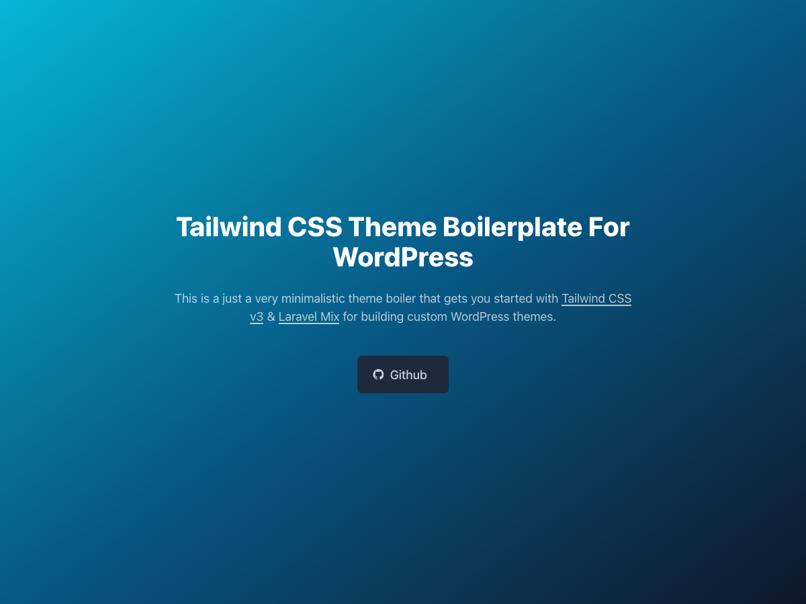

<p align="center">
    
</p>

### Getting started

1. `cd` into your `wp-content/themes` directory

2. Run `git clone https://github.com/ibllex/wp-theme-tailwind-boilerplate.git <theme-name-here>` to clone this repo into
   a new theme

   > Be sure to substitute `<theme-name-here>` with your desired theme name

3. `cd` into your new theme directory

4. Run `npm install`

5. Duplicate the `project-example.json` file to `project.json`, then replace the `proxy` value with your local
   development hostname

6. Run a search & replace in case-sensitive across the theme to replace all instances of **'wttb'** and **'WTTB'** with a text-domain specific to your theme/project
   
7. Change the theme information in `assets/scss/style.scss` and the prepackaged plugin information in `plugins/wttb-additional-features/wttb-additional-features.php`

8. Activate your theme

9. Run `npm run dev` and start coding

### Commands

#### `npm run dev`

Assets will be compiled and BrowserSync will proxy the dev host allowing you to work while seeing your CSS and JS
changes appear on the site as they are recompiled.

#### `npm run webpack`

Runs the development build

#### `npm run prod`

Runs the product build

#### `php pack`

Package the theme files to the release directory

### Prepacked Plugin

Wordpress theme should not include plugin functionality, see [here](https://make.wordpress.org/themes/handbook/review/required/#6-plugins) for detail. But sometimes we need to develop additional features for the theme and don't want to to create a separate project for maintenance. For that, we provide a simple way to develop the plugin and the theme in the same place and install the plugin with [tgm](http://tgmpluginactivation.com/) when release. 

If you don't need this feature, just do this:

1. Remove the following code in your `functions.php`

   ```php
   ...
   // Runtime Plugins
   if ( file_exists( get_stylesheet_directory() . '/plugins/bootstrap.php' ) ) {
   	require get_stylesheet_directory() . '/plugins/bootstrap.php';
   }
   
   /**
    * TGM Plugin Activation Class
    *
    * @see: http://tgmpluginactivation.com/
    */
   require get_stylesheet_directory() . '/inc/tgm/class-tgm-plugin-activation.php';
   
   if ( ! function_exists( 'wttb_register_recommended_plugins' ) ) {
   	function wttb_register_recommended_plugins() {
   		...
   	}
   }
   add_action( 'tgmpa_register', 'wttb_register_recommended_plugins' );
   ...
   ```

2. Editr your `project.json` and set "plugins" to empty.

   ```json
   {
     ...
     "plugins": {}
     ...
   }
   ```

3. Remove these codes in your `webpack.mix.js`

   ```js
   // additional-features
   mix.js('assets/js/additional-features.js', 'dist/additional-features/js');
   mix.sass('assets/scss/additional-features.scss', 'dist/additional-features/css');
   ```

4. Remove related files

   ```shell
   rm -rf ./plugins
   rm -rf ./assets/scss/additional-features.scss
   rm -rf ./assets/js/additional-features.js
   ```

### Refer

Thanks to [mishterk/wp-tailwindcss-theme-boilerplate](https://github.com/mishterk/wp-tailwindcss-theme-boilerplate)


